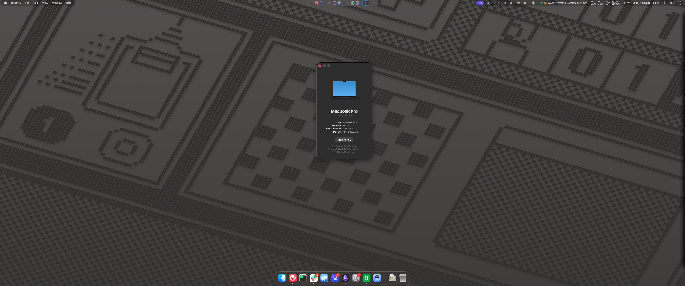

<h3 align="center"> <pre>  <br>   $ dotfiles   <br>  </pre> </h3>



<p>
  
  
  
  
</p>

> [!NOTE]
> `Mar 17, 2024` - My Linux boxes are on NixOS and can be found at [ndom91/nixos-config](https://github.com/ndom91/nixos-config)


## 🚀 Setup

Initial bare repo dotfiles setup

```bash
git init --bare $HOME/.dotfiles
alias dot='git --git-dir=$HOME/.dotfiles --work-tree=$HOME'
dot config status.showUntrackedFiles no
echo "alias dot='git --git-dir=\$HOME/.dotfiles --work-tree=\$HOME'" >> ~/.zshrc
```

Restore on a new machine:

```bash
git clone --bare git@github.com:ndom91/dotfiles.git $HOME/.dotfiles
alias dot='git --git-dir=$HOME/.dotfiles --work-tree=$HOME'
dot checkout
dot config status.showUntrackedFiles no
```

## 📝 License

MIT
